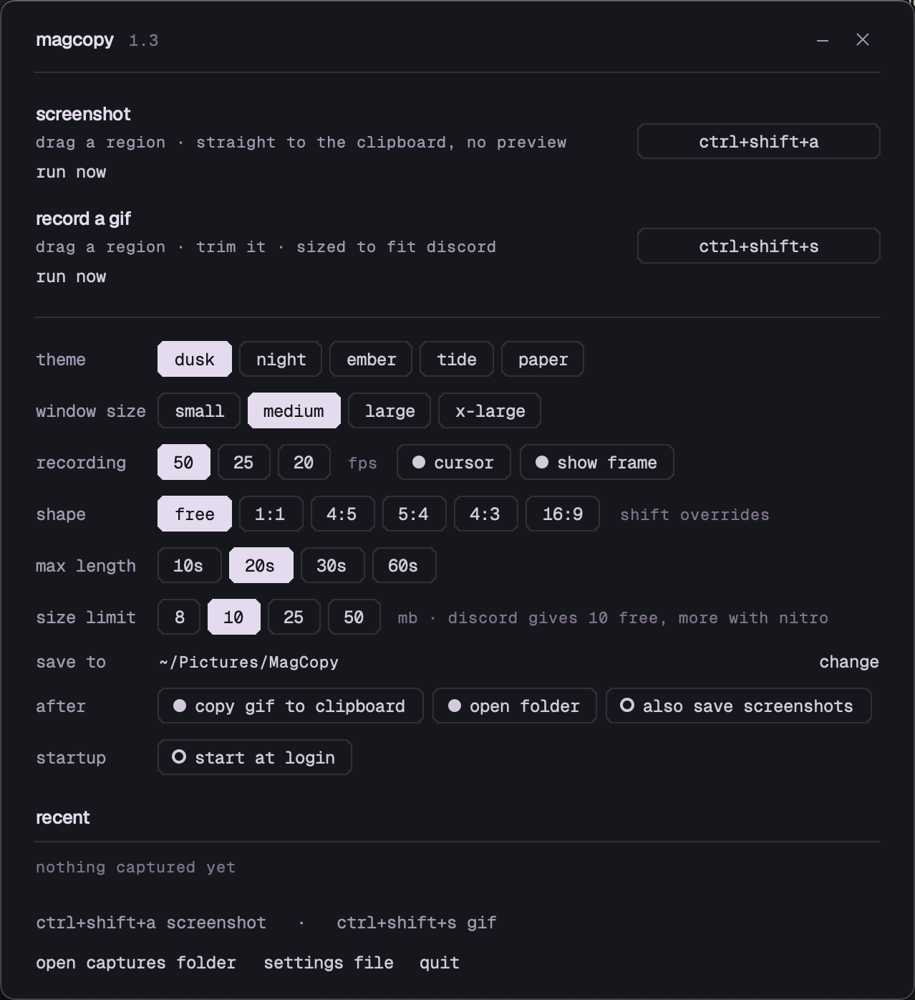

# MagCopy

**Ctrl+Shift+A** — drag a box over anything. It's on your clipboard. No preview, no dialog, no window.

**Ctrl+Shift+S** — drag a box and record it. Escape stops and opens the editor. Trim, crop, save. The GIF comes out as big and as sharp as 10 MB allows.

Windows and macOS. Both shortcuts are rebindable to anything with a modifier in it.

<p>
  <a href="https://github.com/magholmes/MagCopy/releases/latest/download/MagCopy-windows.zip">
    </a>
  &nbsp;
  <a href="https://github.com/magholmes/MagCopy/releases/latest/download/MagCopy-macos.dmg">
    </a>
  &nbsp;
  <a href="https://github.com/magholmes/MagCopy/releases/latest">
    </a>
</p>

<p>
  
  
</p>

*Windows left, macOS right. dusk, one of five palettes — night, ember, tide, paper.*

## Install

**Windows.** One file in the zip: `MagCopy-Setup.exe`. Open it. Per-user, no admin, no questions. Uninstalls from Add or remove programs.

**macOS.** Apple Silicon, 12.3 or newer.

```bash
curl -fsSL https://raw.githubusercontent.com/magholmes/MagCopy/main/install-macos.sh | bash
```

Or take the .dmg and drag it across, then right-click → Open. The curl line skips that because macOS won't open an un-notarised app it thinks came from a browser, and nothing curl fetches carries that mark.

Say yes to **Screen Recording** — the only permission it needs. Refuse it and you get an empty desktop rather than an error, which is macOS's doing, not MagCopy's. You'll be asked again after every update; macOS keys the grant to the code signature and every unsigned build is signed afresh, so remove the stale entry with **−** and allow it again.

Lives in the menu bar or the tray. No Dock icon.

## The GIF pipeline

This is the part with opinions in it.

**Record better than you need to.** Straight into x264 at CRF 14, **yuv444p** — 4:2:0 is what smears text edges. Everything after this is subtraction.

**Frame rate is chosen, not assumed.** GIF stores each frame's delay in hundredths of a second, so only rates of 100/n play true. 30 fps becomes 3 cs and runs **11% fast**. MagCopy records at 50, 25 or 20 and never 30, and every rung of the ladder — 50, 25, 20, 16⅔, 12.5, 10 — is an exact delay and an even decimation.

**Frame rate goes before pixels.** Screen text stops being readable long before motion stops reading as motion, so the ladder drops to 12.5 fps at full size rather than half size at 25. Camera footage wants the opposite; flip the loop order in `magcopy/optimize.py`.

**Measure, don't guess.** A scout pass encodes a few seconds from the middle and extrapolates, which is enough to skip the rungs that can't fit. Then it binary-searches gifski's quality for the largest file under budget and takes a free lossless `gifsicle -O3`.

**Fitting isn't optional.** If nothing on the ladder fits it keeps shrinking until something does. A GIF Discord refuses is not a result.

A 20-second 1280×720 recording lands at full resolution, 12.5 fps, about 9.4 MB, in a minute or two.

You should usually send an MP4 instead — Discord autoplays them and they look better at the same size. MagCopy makes GIFs for when you specifically need a `.gif`.

## Some things that took a while

**Choosing the region.** Recording stays live, because you're about to capture motion. Screenshots freeze, so a menu stays put while you frame it. The selection is a hole cut out of the dim layer, not a lighter rectangle painted on it — a uniformly translucent window can't paint part of itself brighter.

**Aiming.** Full-screen guide lines cost **24 ms per mouse move**; a short cross at the pointer costs 0.08 ms. Thin always-on-top windows are fast but Windows reports a one-pixel layered window as mapped while compositing nothing, so there was no pointer at all.

**Pacing,** borrowed from OBS: a 1 ms system timer on Windows, because the default 15.6 ms granularity can't pace 25 fps and frames arrive in clumps. Timing anchored to the wall clock, not a frame counter — an overrun repeats the previous frame instead of letting the recording slide out of sync. A 4-second capture at 25 fps lands 101 frames and drifts 40 ms on both platforms.

**Capture.** Windows uses GDI, which can't see fullscreen-exclusive games; they come out black. macOS uses ScreenCaptureKit, which sees everything and can leave MagCopy's own windows out of the frame.

**Rebinding a shortcut** takes the live ones off first, and doesn't arm the new one until the keys are up. Otherwise binding Ctrl+Space runs Ctrl+Space: a held key repeats, and a repeat is a key going down.

## Editing

Opens on its own at 80% of the monitor the clip came from, measured while hidden so nothing is seen to resize. Scrub, trim, set a speed, save. Space plays, Ctrl+S saves, Escape discards.

Drag on the picture to crop, then any edge or corner. The crop applies to the full-quality master before anything is scaled, so it spends the whole size budget on the part you kept.

Saving says so while it works — the button reads "saving", a bar tracks which size it's trying, a counter ticks the seconds. ffmpeg can be quiet for half a minute, and a status line that hasn't moved is indistinguishable from a frozen program. When it's done the folder opens with the file selected, and the editor asks **all done?** rather than closing itself.

Files are named for the day — `2026-09-20.gif`, then `-2`, `-3`.

## Settings

| | |
|---|---|
| **theme** | dusk, night, ember, tide, paper |
| **recording** | 50 / 25 / 20 fps, cursor on or off, frame drawn or not |
| **shape** | free, or hold every selection to 1:1, 4:5, 5:4, 4:3, 16:9 |
| **max length** | 10 / 20 / 30 / 60 seconds |
| **size limit** | 8 / 10 / 25 / 50 MB |
| **after** | copy the GIF as a file, show it in its folder, also save screenshots |
| **startup** | start at login, straight to the tray |

The finished GIF goes on the clipboard as a *file*, so Ctrl+V in Discord attaches it rather than pasting a path. Closing the window leaves it running; quit from the tray.

## From source

Python 3.9+ with `numpy` and `Pillow`, plus PyObjC on macOS and a Tk of 8.6 or newer.

```bash
git clone https://github.com/magholmes/MagCopy.git
cd MagCopy
python -m pip install -r requirements.txt
python tools/fetch_binaries.py      # ffmpeg, gifski, gifsicle into ./bin
```

Then `magcopy.pyw`. No build step and no compiled extension: Windows is `ctypes` against Win32, macOS is PyObjC with one small `ctypes` island for Carbon's hotkey API.

Building: `.\build.ps1 -Folder` on Windows, `./build_mac.sh` on a Mac.

## Tests

```bash
python tools/run_all_tests.py
```

Thirty of them, about three minutes, the same set on both platforms. Several sample the screen itself rather than the code's own idea of what it drew, which is how two bugs were found where Windows reported a window as mapped while compositing nothing. One reads every call into the platform layer with `ast` and checks it matches the platform running it — two signatures drifting apart is how recording once failed completely on Windows while the exception was caught and reported as a polite message.

## Known limits

- **Windows:** GDI can't see fullscreen-exclusive games; they come out black.
- **macOS:** Apple Silicon only, 12.3+. Not notarised, so first launch is right-click → Open and Screen Recording has to be granted again after each update. Both are the same missing certificate.
- **macOS:** the editor preview can't be pixel-sharp on Retina — Tk draws one image pixel per *point*. Preview only; the saved GIF comes from the full-resolution master.
- A shortcut another app already owns can't be registered. MagCopy says so and keeps the one that was working.

## Licences

MagCopy is MIT. The encoders are separate programs under their own licences — [ffmpeg](https://ffmpeg.org) (GPL), [gifski](https://gif.ski) (AGPL-3.0), [gifsicle](https://www.lcdf.org/gifsicle/) (GPL-2.0) — and aren't bundled here; `tools/fetch_binaries.py` pulls them from the projects' own releases. [Geist and Geist Mono](https://vercel.com/font) are SIL OFL.

Design lifted from [Opmize](https://github.com/magholmes/Opmize): Are.na's colour ladders, hairlines, lowercase mono labels, pill controls, a frameless rounded window.
