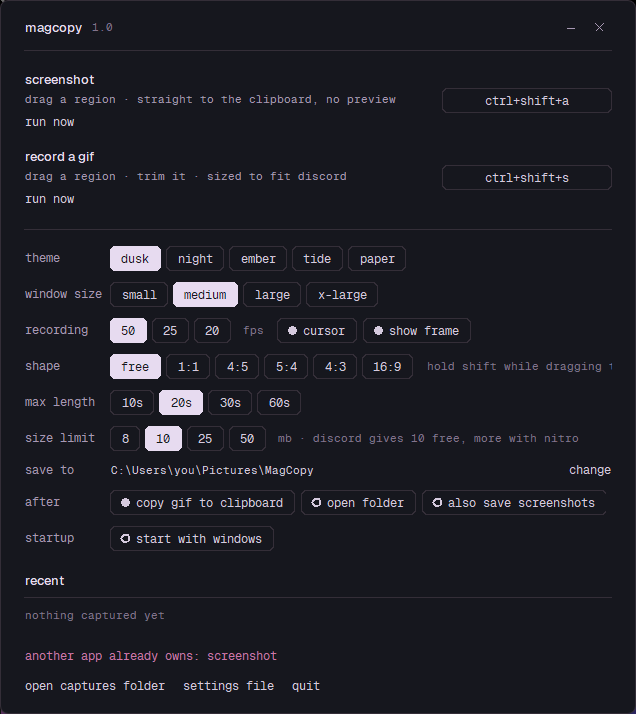

# MagCopy

Two shortcuts, no ceremony.

- **Ctrl+Shift+A** — drag a rectangle over anything. The screenshot goes straight to the clipboard. No preview, no save dialog, no window. Paste it wherever you were going.
- **Ctrl+Shift+S** — drag a rectangle and record it. Trim it, crop it, then save. The GIF comes out as large and sharp as will fit under Discord's limit.

Windows only.

<p>
  <a href="https://github.com/magholmes/MagCopy/releases/latest/download/MagCopy-windows.zip">
    </a>
  &nbsp;
  <a href="https://github.com/magholmes/MagCopy/releases/latest">
    </a>
</p>

That link always serves the newest build. Unzip it anywhere and run `MagCopy.exe` — nothing to
install, no setup. It lives in the notification area.

There is also a single-file `MagCopy.exe` on the [releases page](https://github.com/magholmes/MagCopy/releases/latest)
if you would rather have one file. **Chrome is much more likely to block that one**, for reasons
worth knowing about.

<details>
<summary><b>Why a browser or scanner may call this a virus</b></summary>

It is a false positive, and three things cause it.

**The one-file build unpacks itself.** A single-file PyInstaller executable carries a compressed
Python runtime and a pile of DLLs, writes them into a temporary directory at startup and runs them
from there. That is structurally what a dropper does, and a great deal of real malware is built
with PyInstaller, so scanners match the bootloader itself. This is by far the biggest cause — and
it is why the download above is a zipped folder instead. Nothing self-extracts, and a `.zip` is
not a directly executable download, so neither trigger applies.

**Nothing is signed.** There is no code-signing certificate, so Windows has no reputation for the
file. A new, unsigned executable that few people have downloaded scores badly by construction.
Chrome reports a reputation block with the words "virus detected", which is misleading: no
scanner necessarily found anything.

**What MagCopy does looks like spyware to a behavioural engine.** It captures the screen, reads
and writes the clipboard, registers global hotkeys, adds an autostart entry, hides in the tray and
launches bundled executables. Every one of those is the point of the program. Together they are
also the profile of an infostealer, and a heuristic cannot tell the difference.

If Windows shows SmartScreen's "Windows protected your PC", that is the same reputation problem:
**More info → Run anyway**. If you would rather trust nothing you cannot read, run it from source —
it is a few hundred lines of Python and some `ctypes`, and the instructions are below.

</details>

There is no macOS build, and there will not be one: the capture, clipboard, hotkeys and window
are all Win32.

### The shortcuts are yours

Those two are only the defaults. **Click either shortcut in the window and press whatever you want** —
any combination of Ctrl, Shift, Alt and Win with a key, `Ctrl+Space` or `Alt+F9` or `Win+Shift+3`,
whatever is free on your machine. It takes effect immediately and is remembered.

The one rule is that a shortcut needs at least one modifier, because a bare key would swallow that
key everywhere else. If another application already owns the combination you pick, MagCopy says so,
keeps the one that was working, and tells you from the tray — a shortcut that silently does nothing
is the worst way for this to fail.



*dusk, one of five palettes — also night, ember, tide and paper.*

## Running from source

MagCopy needs Python 3.9+ with `numpy` and `Pillow`, and three external encoders.

```bash
git clone https://github.com/magholmes/MagCopy.git
cd MagCopy
python -m pip install -r requirements.txt
python tools/fetch_binaries.py      # downloads ffmpeg, gifski and gifsicle into ./bin
```

Then double-click `magcopy.pyw`, or run `Launch MagCopy.bat`.

Everything else is `ctypes` against Win32, so there is no build step and no compiled extension to install.

Closing the window leaves MagCopy running — the shortcuts keep working and it sits in the notification area. Quit from the tray icon's right-click menu, or the `quit` link in the window.

It starts with Windows by default (straight to the tray, no window), and only ever runs one copy: launching it again just brings the running one forward, because two copies cannot both hold the same global shortcuts.

## The GIF pipeline

This is the part with opinions in it.

**The recording is deliberately over-good.** Frames are captured with GDI `BitBlt` into a reused device context and piped straight to x264 at CRF 14 in **yuv444p**. No chroma subsampling: for screen content, 4:2:0 is what makes text edges smear. Everything after this is a reduction, so the master is the one place not to throw anything away.

**Frame rate is chosen, not assumed.** A GIF stores each frame's delay in hundredths of a second, so only rates of the form 100/n play back at true speed. 30 fps becomes 3 cs and runs **11% fast** — which is why MagCopy records at 50 fps by default (or 25, or 20) and never 30, and why every rung of the quality ladder (50, 25, 20, 16⅔, 12.5, 10) is both an exact centisecond delay and an even decimation of the recording.

**The optimiser spends frame rate before it spends pixels.** Screen recordings fail differently from camera footage: text stops being readable long before motion stops reading as motion. So when something has to give, the ladder drops to 12.5 fps at full resolution rather than half resolution at 25 fps. (For camera footage the right call is the opposite — see the note below.)

**It measures instead of guessing.** A scout pass encodes a few contiguous seconds from the middle and extrapolates by duration, which is enough to skip the rungs that provably cannot fit. Then at the chosen rung it binary-searches gifski's quality for the largest file still under budget, and finishes with a free lossless `gifsicle -O3`.

**Fitting is not optional.** If nothing on the ladder fits, it keeps shrinking until something does. A GIF that Discord refuses is not a result.

On a 20-second 1280×720 screen recording this lands at full resolution, 12.5 fps and about 9.4 MB, taking a minute or two depending on how much of the picture moves. Short clips take a few seconds.

### Why not just send an MP4?

You usually should — Discord autoplays them and they look far better at the same size. GIF's 256-colour palette costs more quality than the size limit does. MagCopy makes GIFs because sometimes you specifically need a `.gif`.

### Tuned for camera footage instead?

Flip the preference in `magcopy/optimize.py`: walk the ladder frame-rate-outermost rather than scale-outermost. For video, smoothness carries the clip and resolution is what you can afford to lose.

## What it borrows from OBS

- **A 1 ms system timer** (`timeBeginPeriod`) for the length of the capture, plus a short spin at the end of each wait. Windows' default scheduling granularity is 15.6 ms, which cannot pace a 25 fps loop at all — frames arrive in clumps. With it, a 4-second capture at 25 fps lands 101 frames and drifts 40 ms.
- **Above-normal thread priority** while recording, so an unrelated busy process can't shear the capture.
- **Timing anchored to the wall clock**, not to a frame counter. If a capture overruns its slot the loop repeats the previous frame rather than letting the recording slide quietly out of sync with what actually happened. Repeats are counted and reported.

**What it doesn't borrow:** OBS captures through Windows Graphics Capture / DXGI desktop duplication. That is genuinely better — hardware-accelerated, and it can see GPU-composited and fullscreen-exclusive windows that GDI returns as black. It also needs WinRT and D3D11 interop, which is well past what `ctypes` should be asked to do. GDI with `CAPTUREBLT` covers the desktop and application UI, which is what this tool is for. **Full-screen games are the known gap.**

## Settings

Everything lives in the window, and in `settings.json` next to the script (or `%APPDATA%\MagCopy\` when frozen).

| | |
|---|---|
| **theme** | dusk, night, ember, tide, paper — the selection accent, crop handles, playhead and dim all follow it |
| **window size** | small → x-large |
| **recording** | 50 / 25 / 20 fps (50 by default), cursor on or off, and whether to draw the frame |
| **shape** | free, or hold every selection to 1:1, 4:5, 5:4, 4:3 or 16:9 — shift overrides it mid-drag |
| **max length** | 10 / 20 / 30 / 60 seconds (20 by default) |
| **size limit** | 8 / 10 / 25 / 50 MB — Discord gives 10 free, more with Nitro |
| **after** | copy the GIF to the clipboard as a file, show it in its folder (on by default), also save screenshots |
| **startup** | start with Windows — on by default, launching straight to the tray |

The finished GIF goes on the clipboard as a *file*, so Ctrl+V in Discord attaches it rather than pasting a path.

## Choosing the region

Recording and screenshots pick a region differently, on purpose.

**Recording is live.** Nothing freezes: you are about to capture motion, so the screen keeps moving while you choose, and the selection shows at full brightness while everything around it dims. That is a hole cut out of the dim layer rather than a lighter rectangle painted on it — a uniformly translucent window cannot paint part of itself brighter. It also opens instantly, since there is no frame to capture first.

**Screenshots freeze.** That one is deliberate: a menu or a tooltip stays put while you frame it, and what you framed is exactly what you get.

You aim with the OS crosshair cursor plus a small drawn cross at the pointer. Two earlier attempts are worth not repeating: full-screen guide lines on the canvas cost **24 ms per mouse move**, because moving a line that long forces a repaint — and on a layered window a recomposite — the size of the screen, which is visible lag just hovering around deciding where to drag. Moving thin always-on-top windows instead is fast, but Windows reports a one- or two-pixel layered window as *mapped while compositing nothing*, so the screen showed no pointer at all. A short cross near the cursor costs 0.08 ms and actually appears.

With a **shape** set, the drag is held to that ratio — including when it is clamped at the edge of the desktop, which is exactly where a naive implementation quietly bends it back out of shape. Hold shift to override it for one drag; with no shape set, shift means square.

## While recording

A viewfinder marks the region for the length of the recording: a soft hairline edge stating where the boundary is, solid brackets at the four corners, and a small bar with the elapsed time and stop/cancel. The weight is in the corners rather than in the line, so the region reads as framed without a red box sitting on top of whatever you are recording.

Every piece sits *outside* the captured rectangle and is click-through, so none of it can appear in the GIF and none of it eats a click meant for the app you are recording. Turn it off with the `show frame` toggle.

## Editing

The editor opens on its own after a recording, taking at most 80% of the monitor the clip was recorded on — and never upscaling past the recording's own size, since blowing a small capture up only makes it soft. It measures its own controls while still hidden to work out how much room the picture can have, and is mapped once at that size, so nothing is ever seen to resize. Scrub the filmstrip, drag the handles to trim, set a speed, save. Space plays, Ctrl+S saves, Escape discards.

Captures are named for the day — `2026-09-20.gif`, then `-2`, `-3` — because the name you read should be the date, not a wall of digits that all look alike.

When the GIF is written the file is shown in its folder — selected, not just the folder opened — and the editor asks **all done?** rather than closing itself. `done` closes it, `keep editing` leaves everything as it was so you can adjust the trim or crop and save again. A GIF is often nearly right, and finding out means looking at the file, so nothing is thrown away until it is asked for.

**Drag on the picture to crop**, then drag any edge or corner to adjust it, or drag from inside to move the whole box. `save crop` locks it in; `reset crop` puts it back. The crop is applied to the full-quality master before anything is scaled, so cropping to the interesting part spends the whole size budget on it instead of on the parts you were going to throw away.

Playback runs at the recorded frame rate — a 50 fps recording previews at 50 fps — and is anchored to the wall clock rather than stepping a fixed number of milliseconds per tick, because every late tick is time the clip never gets back and the preview slowly drifts behind real time.

Preview frames are extracted once as small JPEGs and paged in on demand — scrubbing a video file through a decoder is far too slow to feel like scrubbing. The trim is still expressed in seconds against the full-quality master, so nothing about the preview limits the output.

## Building a standalone .exe

```powershell
python -m pip install pyinstaller
.\build.ps1
```

```powershell
.uild.ps1 -Folder
```

`build.ps1` produces a single `dist\MagCopy.exe`; `-Folder` produces `dist\MagCopy\` plus a zipped
`dist\MagCopy-windows.zip`. Both carry the fonts and encoders (large, because ffmpeg is), and both
put settings in `%APPDATA%\MagCopy\`.

The folder build is the one worth releasing. It does not unpack itself at startup, which is the
behaviour that makes scanners flag a one-file build, and its own executable is 6 MB rather than
61 MB because the runtime sits beside it instead of inside it.

## Look and feel

Are.na's colour ladders, the layout language of the magnus archive site — hairlines, Geist and Geist Mono, lowercase mono labels, pill controls — in a frameless, rounded window. Same as [Opmize](https://github.com/magholmes/Opmize), which is where the design came from. Rounded corners need Windows 11; on Windows 10 they stay square.

## Licences

MagCopy is MIT (see `LICENSE`). The tools it runs are separate programs, invoked as subprocesses, under their own licences:

| | |
|---|---|
| [ffmpeg](https://ffmpeg.org) | GPL (the gyan.dev "essentials" build) |
| [gifski](https://gif.ski) | AGPL-3.0 |
| [gifsicle](https://www.lcdf.org/gifsicle/) | GPL-2.0 |
| [Geist / Geist Mono](https://vercel.com/font) | SIL Open Font Licence — see `fonts/LICENSE-Geist-OFL.txt` |

The three encoders are not bundled in this repository; `tools/fetch_binaries.py` downloads them
from the projects' own releases and checks each one runs.

The icon is built from `icon_source.png`, a cut-out the author owns:
`python tools/cutout.py photo.jpg icon_source.png`, then
`python tools/make_icon.py icon_source.png`.

## Checking an install

```powershell
MagCopy.exe --selftest
```

Reports whether the encoders, settings folder, screen capture, clipboard, fonts and hotkey parsing
are all working, and leaves the same report in `%APPDATA%\MagCopy\selftest.txt`.

## Known limits

- Windows only. Capture, clipboard, hotkeys and the frameless window are all Win32.
- GDI capture cannot see fullscreen-exclusive games or some GPU-composited surfaces; those come out black.
- A shortcut already owned by another application cannot be registered. MagCopy says so in the window and from the tray, and keeps the one that was working. Pick another.
- Long recordings at high resolution take a while to encode. The status line tells you what it is trying.

## Tests

```bash
python tools/run_all_tests.py
```

Nineteen smoke tests, two to three minutes. They drive the real region selector; measure recording
pace against the wall clock; check a locked aspect ratio survives every drag direction and the edge
of the desktop; walk every theme, window size and palette colour; size the editor against each
monitor at each UI scale; exercise the crop handles; run a real recording through the editor and out
the other side as a GIF; and read the emitted GIF back by parsing its block structure rather than
trusting the encoder.

Several sample the screen itself rather than the code's own idea of what it drew — that the
recording frame is really on screen, that the selection accent really is the theme's colour — which
is how two bugs were found where Windows reported a window as mapped while compositing nothing.
